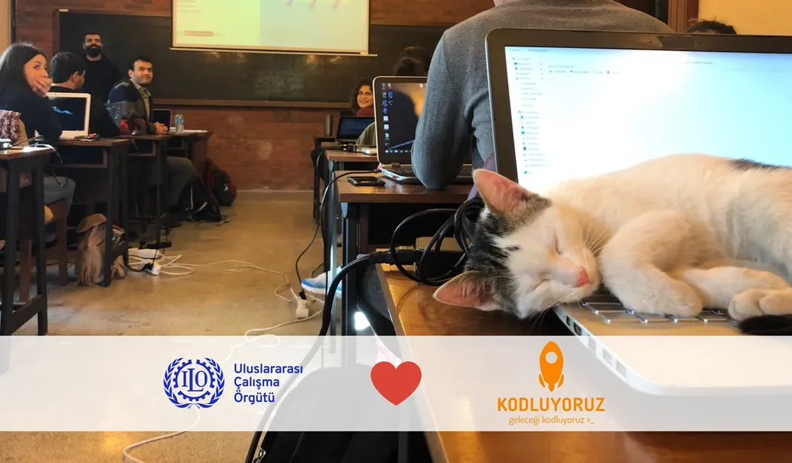

# Kodluyoruz Java Bootcamp Ödevleri

Bu repo [Kodluyoruz 95. Ankara Java Bootcamp](https://www.kodluyoruz.org/bootcamp/ankara-java-bootcamp) süresince verilen ödevlerin çözümlerini barındırıyor.



## Installation

Öncelikle projeyi clonelayın.

```bash
git clone https://github.com/95-Ankara-Java-BootCamp/assignments-yunus-yildirim.git
```

## Usage

Projeyi cloneladıktan sonra Visual Studio Code programında açınız.  

Windows için:
```powershell
cd assignments-yunus-yildirim
code .
```
- ***Not***:
*Visual Studio Code içerisinde kodları düzenleyebilmek ve çalıştırabilmek için **Java Extension Pack** ve **Debugger for Java** eklentileri yüklü olması gerekiyor veya bir [Java IDE](https://www.educative.io/blog/best-java-ides-2021)'si kullanabilirsiniz.*


## License
[MIT](https://choosealicense.com/licenses/mit/)
